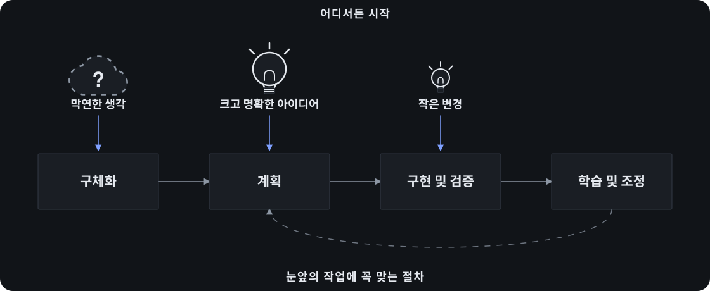

[](https://www.npmjs.com/package/bmad-method)
[](LICENSE)
[](https://discord.gg/gk8jAdXWmj)

[English](README.md) | [简体中文](README_CN.md) | [Tiếng Việt](README_VN.md) | 한국어

**애자일 AI 주도 개발 — 사고 과정을 포기하지 않고 아이디어나 변경 요청을 실제 작동하는 소프트웨어로 바꿉니다.**

AI 주도 개발(AiDD)은 코드 작성에 그치지 않습니다. 무엇을 만들지, 각 요소가 어떻게 맞물리는지, 새롭게 알게 된 내용에 따라 어떻게 바꿀지까지 개발 전반을 아우릅니다. BMad Method는 이를 애자일 방식으로 실천합니다. 결정은 명확히 남고 컨텍스트는 다음 작업으로 이어지며 작업 규모에 맞춰 절차도 달라집니다. 작은 변경은 바로 Build로 진행하고 복잡한 작업은 필요한 만큼 깊이 계획합니다. 주말에 만드는 프로토타입부터 오랜 역사를 지닌 시스템까지 같은 방법으로 다룹니다.



_어디서든 시작하세요. BMad를 처음부터 끝까지 사용해도 되고 개요·사양·아키텍처만 기존 개발 흐름에 가져와도 됩니다._

## 바로 시작하기

**필수 조건:** [Node.js](https://nodejs.org) 20.12+, [Python](https://www.python.org) 3.10+, [uv](https://docs.astral.sh/uv/)

```bash
npx bmad-method install
```

프로젝트를 AI 코딩 도구에서 열고 `bmad-build`에 원하는 변경을 말하세요. 중요한 결정은 직접 내리면서 작업을 이어 가면 됩니다. 다음 단계나 선택 사항을 안내받고 싶을 때는 언제든 `bmad-help`를 실행하세요.

**[BMad로 첫 변경 사항 구현하기 →](https://docs.bmad-method.org/ko-kr/start/build-your-first-change/)**

**[기존 코드베이스에 BMad 적용하기 →](https://docs.bmad-method.org/ko-kr/how-to/established-projects/)**

BMad는 무료 오픈 소스이며 유료 전용 워크플로나 가입이 제한된 커뮤니티가 없습니다. 설치 필수 조건, 업데이트, 사전 릴리스 빌드, 설치 프로그램의 최신 자동화 도움말은 [설치 가이드](https://docs.bmad-method.org/ko-kr/start/install-bmad/)를 참고하세요.

## 왜 BMad인가요?

코딩 도우미는 구현에는 능숙하지만 명시하지 않은 가정을 그대로 코드로 옮기기도 합니다. BMad는 중요한 결정을 명확히 드러내고 다음 작업에 필요한 컨텍스트로 남기는 에이전트와 워크플로를 제공합니다. 판단은 사용자가 직접 내립니다.

- **작업에 맞는 절차** — 명확한 변경은 바로 구현하고 큰 과제는 더 깊이 계획합니다.
- **신규·기존 코드 모두 지원** — 빈 프로젝트에서 시작하거나, 물려받은 코드베이스의 컨텍스트를 검증해 현재 상태에 맞춰 작업합니다.
- **지속되는 컨텍스트** — 대화할 때마다 다시 설명하지 않아도 제품과 기술 결정을 다음 작업으로 이어 갑니다.
- **분야별 관점** — 필요할 때 제품, 아키텍처, UX, 개발, 테스트 전문가의 관점을 활용합니다.
- **안내형 협업** — 판단을 맡기지 않고도 구조화된 워크플로와 여러 에이전트의 토론을 활용합니다.
- **하나로 이어지는 개발 흐름** — 초기 구상부터 검토를 거친 구현, 방향 수정, 학습까지 한 흐름으로 진행합니다.

[워크플로가 어떻게 연결되는지 보기 →](https://docs.bmad-method.org/ko-kr/reference/workflow-map/)

## BMad 생태계

핵심 프레임워크만 설치하거나 전문 작업을 위한 공식 모듈을 추가합니다.

| 모듈 | 용도 |
| --- | --- |
| **[BMad Method](https://github.com/bmad-code-org/BMAD-METHOD)** | 새 프로토타입부터 기존 코드베이스까지 소프트웨어를 계획하고 완성합니다. |
| **[BMad Builder](https://github.com/bmad-code-org/bmad-builder)** | 스킬, 워크플로, 에이전트를 만듭니다. |
| **[BMad Creative Intelligence Suite](https://github.com/bmad-code-org/bmad-module-creative-intelligence-suite)** | 혁신, 디자인 사고, 스토리텔링을 위한 창의적 사고 파트너를 제공합니다. |
| **[BMad Test Architect](https://github.com/bmad-code-org/bmad-method-test-architecture-enterprise)** | BMad Method에 엔터프라이즈 테스트 기능을 더합니다. |
| **[BMad Loop](https://github.com/bmad-code-org/bmad-loop)** | 에픽 전체를 사람의 개입 없이 구현하고 검증한 뒤 회고합니다. |
| **[BMad Game Dev Studio](https://github.com/bmad-code-org/bmad-module-game-dev-studio)** | Unity, Unreal, Godot, Phaser를 비롯한 모든 프레임워크에서 게임을 구상하고 설계해 구현합니다. |

## 웹에서 계획하기

[Web bundle](https://bmadcode.com/web-bundles/)은 일부 BMad 워크플로를 Google Gemini Gem과 ChatGPT Custom GPT로 패키징한 것입니다. 기존 웹 구독 환경에서 계획을 세운 뒤, 그 결과물을 AI 코딩 도구로 가져와 구현에 사용하세요.

## 문서

- **[첫 변경 사항 구현하기](https://docs.bmad-method.org/ko-kr/start/build-your-first-change/)** — BMad를 설치하고 작은 프로젝트를 만듭니다.
- **[워크플로 맵](https://docs.bmad-method.org/ko-kr/reference/workflow-map/)** — 사용할 수 있는 경로와 산출물을 살펴봅니다.
- **[기존 프로젝트](https://docs.bmad-method.org/ko-kr/how-to/established-projects/)** — 기존 코드베이스에 BMad를 적용합니다.
- **[v6로 업그레이드](https://docs.bmad-method.org/ko-kr/how-to/upgrade-to-v6/)** — 이전 버전에서 마이그레이션합니다.

## 커뮤니티

- [Discord](https://discord.gg/gk8jAdXWmj) — 도움을 받고 아이디어를 나누며 협업합니다.
- [YouTube](https://youtube.com/@BMadCode) — 튜토리얼과 마스터 클래스를 시청합니다.
- [GitHub Issues](https://github.com/bmad-code-org/BMAD-METHOD/issues) — 버그를 제보하고 기능을 요청합니다.
- [GitHub Discussions](https://github.com/bmad-code-org/BMAD-METHOD/discussions) — 커뮤니티의 긴 대화에 참여합니다.
- [BMad Code](https://bmadcode.com) — 더 넓은 BMad 생태계를 둘러봅니다.

## 후원과 기여

BMad는 누구에게나 무료이며 앞으로도 계속 무료로 제공됩니다. 저장소에 스타를 누르거나 [커피 한 잔을 후원](https://buymeacoffee.com/bmad)해 주세요. 기업 후원은 <contact@bmadcode.com>으로 문의해 주세요.

기여를 환영합니다. Pull Request를 열기 전에 [CONTRIBUTING.md](CONTRIBUTING.md)를 읽어 주세요.

## 라이선스

MIT 라이선스를 따릅니다. 자세한 내용은 [LICENSE](LICENSE)를 참고하세요.

**BMad**와 **BMAD-METHOD**는 BMad Code, LLC의 상표입니다. 자세한 내용은 [TRADEMARK.md](TRADEMARK.md)를 참고하세요.

기여하려면 Discord에 참여하고 먼저 [CONTRIBUTORS.md](CONTRIBUTORS.md)를 읽어 주세요.
