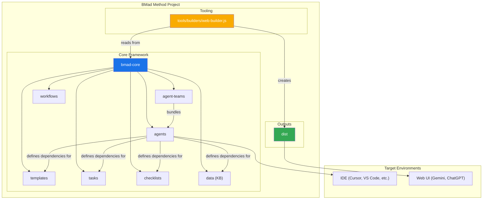
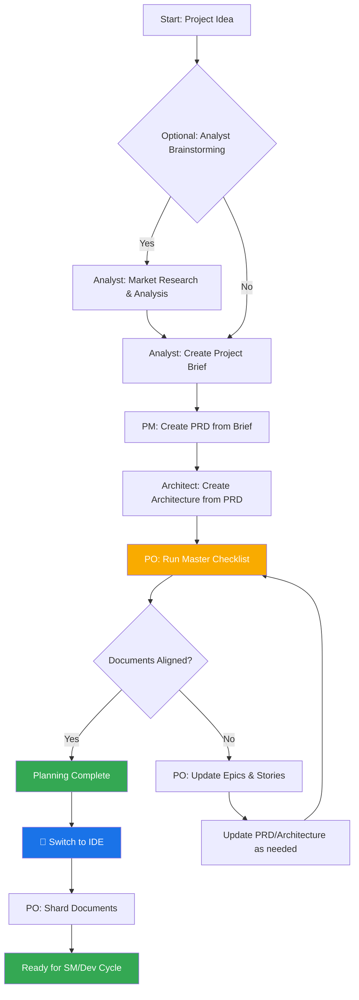
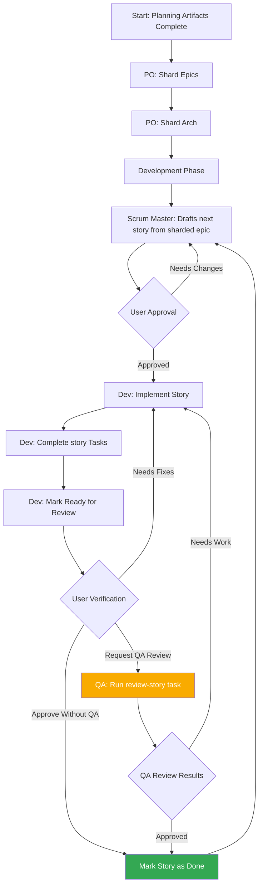

# BMad 方法：核心架构

## 1. 概述

BMad 方法旨在提供代理模式、任务和模板，以实现可重复的有用工作流，无论是用于敏捷代理开发，还是扩展到完全不同的领域。该项目的核心目的是提供一组结构化但灵活的提示、模板和工作流，用户可以使用它们来指导 AI 代理（如 Gemini、Claude 或 ChatGPT）以可预测、高质量的方式执行复杂任务、引导讨论或其他有意义的特定领域流程。

系统核心模块促进了完整的开发生命周期，以适应当前现代 AI 代理工具的挑战：

1. **构思与规划**：头脑风暴、市场研究和创建项目简介。
2. **架构与设计**：定义系统架构和 UI/UX 规范。
3. **开发执行**：一个周期性工作流，其中 Scrum Master（SM）代理起草具有极其特定上下文的故事，而 Developer（Dev）代理一次实现一个故事。此过程适用于新项目（Greenfield）和现有项目（Brownfield）。

## 2. 系统架构图

整个 BMad-Method 生态系统围绕安装的 `bmad-core` 目录设计，该目录充当操作的大脑。`tools` 目录提供了为不同环境处理和打包这个大脑的方法。

## 3. 核心组件

`bmad-core` 目录包含赋予代理能力的所有定义和资源。

### 3.1. 代理（`bmad-core/agents/`）

- **目的**：这些是系统的基础构建块。每个 markdown 文件（例如，`bmad-master.md`、`pm.md`、`dev.md`）定义了单个 AI 代理的角色、能力和依赖关系。
- **结构**：代理文件包含一个 YAML 头部，指定其角色、角色定位、依赖关系和启动指令。这些依赖关系是代理被允许使用的任务、模板、清单和数据文件的列表。
- **启动指令**：代理可以包含加载项目特定文档的启动序列，这些文档来自 `docs/` 文件夹，如编码标准、API 规范或项目结构文档。这在激活时提供即时的项目上下文。
- **文档集成**：代理可以在任务、工作流或启动序列中引用和加载项目 `docs/` 文件夹中的文档。用户也可以直接将文档拖入聊天界面以提供额外上下文。
- **示例**：`bmad-master` 代理列出了其依赖关系，这告诉构建工具哪些文件应包含在 web 包中，并告知代理其自身的能力。

### 3.2. 代理团队（`bmad-core/agent-teams/`）

- **目的**：团队文件（例如，`team-all.yaml`）定义了为特定目的捆绑在一起的代理和工作流集合，如"全栈开发"或"仅后端"。这为 web UI 环境创建了一个更大的、预打包的上下文。
- **结构**：团队文件列出要包含的代理。它可以使用通配符，例如 `"*"` 来包含所有代理。这允许创建像 `team-all` 这样的综合捆绑包。

### 3.3. 工作流（`bmad-core/workflows/`）

- **目的**：工作流是 YAML 文件（例如，`greenfield-fullstack.yaml`），定义了特定项目类型的规定步骤序列和代理交互。它们作为用户和 `bmad-orchestrator` 代理的战略指南。
- **结构**：工作流定义了复杂和简单项目的序列，列出了每个步骤涉及的代理、它们创建的工件以及从一个步骤移动到下一个步骤的条件。它通常包括一个 Mermaid 图表用于可视化。

### 3.4. 可重用资源（`templates`、`tasks`、`checklists`、`data`）

- **目的**：这些文件夹包含模块化组件，代理根据其依赖关系动态加载这些组件。
  - **`templates/`**：包含常见文档的 markdown 模板，如 PRD、架构规范和用户故事。
  - **`tasks/`**：定义执行特定、可重复操作的指令，如 "shard-doc" 或 "create-next-story"。
  - **`checklists/`**：为产品负责人（`po`）或架构师等代理提供质量保证清单。
  - **`data/`**：包含核心知识库（`bmad-kb.md`）、技术偏好（`technical-preferences.md`）和其他关键数据文件。

#### 3.4.1. 模板处理系统

BMad 的一个关键架构原则是模板是自包含和交互式的 - 它们嵌入了所需的文档输出和与用户合作所需的 LLM 指令。这意味着在许多情况下，文档创建不需要单独的任务，因为模板本身包含所有处理逻辑。

BMad 框架采用了一个复杂的模板处理系统，由三个关键组件协调：

- **`template-format.md`**（`bmad-core/utils/`）：定义了所有 BMad 模板中使用的基础标记语言。此规范建立了变量替换（`{{placeholders}}`）、仅 AI 处理指令（`[[LLM: instructions]]`）和条件逻辑块的语法规则。模板遵循此格式，以确保整个系统的一致处理。

- **`create-doc.md`**（`bmad-core/tasks/`）：作为编排引擎，管理整个文档生成工作流。此任务协调模板选择、管理用户交互模式（增量与快速生成）、执行模板格式处理规则并处理验证。它是用户和模板系统之间的主要接口。

- **`advanced-elicitation.md`**（`bmad-core/tasks/`）：提供一个交互式细化层，可以通过 `[[LLM: instructions]]` 块嵌入到模板中。此组件提供 10 种结构化头脑风暴操作、逐节审查功能和迭代改进工作流，以提高内容质量。

系统保持关注点的清晰分离：模板标记由 AI 代理内部处理，但从不向用户公开，同时通过模板本身嵌入的智能提供复杂的 AI 处理能力。

#### 3.4.2. 技术偏好系统

BMad 通过 `bmad-core/data/` 中的 `technical-preferences.md` 文件包含个性化层。此文件作为一个持久的技术配置文件，影响所有项目中的代理行为。

**目的和好处：**

- **一致性**：确保所有代理引用相同的技术偏好
- **效率**：消除了重复指定首选技术的需要
- **个性化**：代理提供与用户偏好一致的建议
- **学习**：捕获随着时间推移而演变的经验教训和偏好

**内容结构：**
该文件通常包括首选技术栈、设计模式、外部服务、编码标准和要避免的反模式。代理在规划和开发过程中自动引用此文件，以提供上下文相关的建议。

**集成点：**

- 模板可以在文档生成过程中引用技术偏好
- 代理在适合项目需求时建议首选技术
- 当偏好不适合项目需求时，代理解释替代方案
- Web 包可以包含首选项内容，以确保跨平台的一致行为

**随时间演变：**
鼓励用户不断用项目中的发现更新此文件，添加正面偏好和要避免的技术，创建一个个性化知识库，随着时间的推移改进代理建议。

## 4. 构建和交付过程

该框架专为两个主要环境设计：本地 IDE 和基于 Web 的 AI 聊天界面。`web-builder.js` 脚本是支持后者的关键。

### 4.1. Web Builder（`tools/builders/web-builder.js`）

- **目的**：这个 Node.js 脚本负责创建 `dist` 中找到的 `.txt` 捆绑包。
- **过程**：
  1. **解析依赖关系**：对于给定的代理或团队，脚本读取其定义文件。
  2. 它递归地查找代理/团队需要的所有依赖资源（任务、模板等）。
  3. **捆绑内容**：它读取所有这些文件的内容，并将它们连接成一个大的文本文件，使用清晰的分隔符指示每个部分的原始文件路径。
  4. **输出捆绑包**：最终的 `.txt` 文件保存在 `dist` 目录中，准备上传到 web UI。

### 4.2. 环境特定用法

- **对于 IDE**：用户通过 `bmad-core/agents/` 中的 markdown 文件直接与代理交互。IDE 集成（适用于 Cursor、Claude Code 等）知道如何调用这些代理。
- **对于 Web UI**：用户从 `dist` 上传预构建的捆绑包。这个单一文件为 AI 提供了整个团队及其所需的所有工具和知识的上下文。

## 5. BMad 工作流

### 5.1. 规划工作流

在开发开始之前，BMad 遵循结构化的规划工作流，为成功的项目执行建立基础：

**关键规划阶段：**

1. **可选分析**：分析师进行市场研究和竞争分析
2. **项目简介**：由分析师或用户创建的基础文档
3. **PRD 创建**：PM 将简介转换为全面的产品需求
4. **架构设计**：架构师基于 PRD 创建技术基础
5. **验证与对齐**：PO 确保所有文档一致且完整
6. **细化**：根据需要更新史诗、故事和文档
7. **环境转换**：从 web UI 到 IDE 进行开发工作流的关键切换
8. **文档准备**：PO 将大文档分片以供开发使用

**工作流编排**：`bmad-orchestrator` 代理使用这些工作流定义来指导用户完成整个过程，确保规划（web UI）和开发（IDE）阶段之间的适当过渡。

### 5.2. 核心开发周期

一旦初始规划和架构阶段完成，项目将进入周期性开发工作流，如 `bmad-kb.md` 中详述。这确保了一个稳定、顺序和质量控制的实施过程。

这个周期继续进行，Scrum Master、开发人员和可选的 QA 代理一起工作。QA 代理通过 `review-story` 任务提供高级开发人员审查功能，提供代码重构、质量改进和知识转移。这确保了高代码质量，同时保持开发速度。