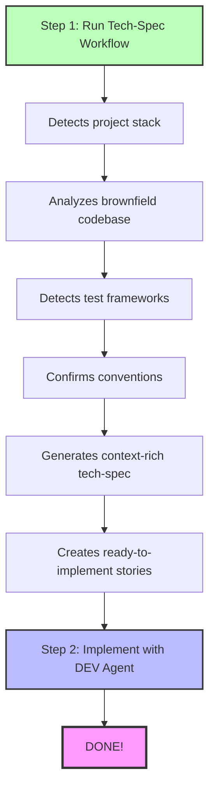

Quick Spec Flow is a streamlined alternative to the full BMad Method for Quick Flow track projects. Instead of going through Product Brief → PRD → Architecture, you go straight to a context-aware technical specification and start coding.

- **Perfect for:** Bug fixes, small features, rapid prototyping, and quick enhancements
- **Time to implementation:** Minutes, not hours

## When to Use Quick Flow

### Use Quick Flow when:

- Single bug fix or small enhancement
- Small feature with clear scope (typically 1-15 stories)
- Rapid prototyping or experimentation
- Adding to existing brownfield codebase
- You know exactly what you want to build

### Use BMad Method or Enterprise when:

- Building new products or major features
- Need stakeholder alignment
- Complex multi-team coordination
- Requires extensive planning and architecture

:::tip[Not Sure?]
Run `workflow-init` to get a recommendation based on your project's needs.
:::

## Quick Flow Overview



## What Makes It Quick

- No Product Brief needed
- No PRD needed
- No Architecture doc needed
- Auto-detects your stack
- Auto-analyzes brownfield code
- Auto-validates quality
- Story context optional (tech-spec is comprehensive)

## Smart Context Discovery

Quick Spec Flow automatically discovers and uses:

### Existing Documentation
- Product briefs (if they exist)
- Research documents
- `document-project` output (brownfield codebase map)

### Project Stack
- **Node.js:** package.json → frameworks, dependencies, scripts
- **Python:** requirements.txt, pyproject.toml → packages, tools
- **Ruby:** Gemfile → gems and versions
- **Java:** pom.xml, build.gradle → Maven/Gradle dependencies
- **Go:** go.mod → modules
- **Rust:** Cargo.toml → crates

### Brownfield Code Patterns
- Directory structure and organization
- Existing code patterns (class-based, functional, MVC)
- Naming conventions
- Test frameworks and patterns
- Code style configurations

### Convention Confirmation

Quick Spec Flow detects your conventions and **asks for confirmation**:

```
I've detected these conventions in your codebase:

Code Style:
- ESLint with Airbnb config
- Prettier with single quotes

Test Patterns:
- Jest test framework
- .test.js file naming

Should I follow these existing conventions? (yes/no)
```

**You decide:** Conform to existing patterns or establish new standards!

## Auto-Validation

Quick Spec Flow **automatically validates** everything:

- Context gathering completeness
- Definitiveness (no "use X or Y" statements)
- Brownfield integration quality
- Stack alignment
- Implementation readiness

## Comparison: Quick Flow vs Full BMM

| Aspect                | Quick Flow Track             | BMad Method/Enterprise Tracks      |
| --------------------- | ---------------------------- | ---------------------------------- |
| **Setup**             | None (standalone)            | workflow-init recommended          |
| **Planning Docs**     | tech-spec.md only            | Product Brief → PRD → Architecture |
| **Time to Code**      | Minutes                      | Hours to days                      |
| **Best For**          | Bug fixes, small features    | New products, major features       |
| **Context Discovery** | Automatic                    | Manual + guided                    |
| **Validation**        | Auto-validates everything    | Manual validation steps            |
| **Brownfield**        | Auto-analyzes and conforms   | Manual documentation required      |

## When to Graduate to BMad Method

Start with Quick Flow, but switch to BMad Method when:

- Project grows beyond initial scope
- Multiple teams need coordination
- Stakeholders need formal documentation
- Product vision is unclear
- Architectural decisions need deep analysis
- Compliance/regulatory requirements exist

:::tip[Transition Tip]
You can always run `workflow-init` later to transition from Quick Flow to BMad Method.
:::
