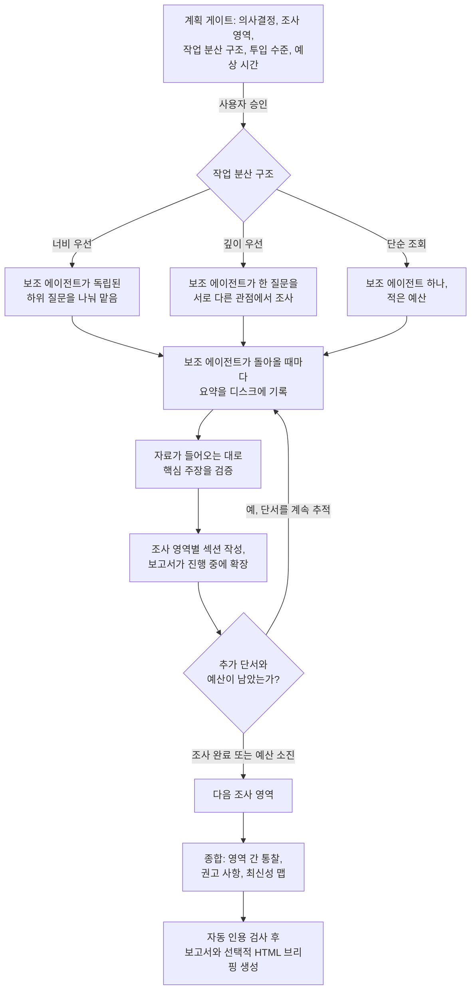

Deep Recon은 의사결정에 필요한 어떤 주제든 조사합니다. 이 문서에서는 세 가지 모드와 선택 기준, 리서치를 직접 실행할 때 내부에서 일어나는 일을 설명합니다.

## Deep Recon이란?

`bmad-deep-recon`을 실행하면 단순한 검색 엔진이 아니라 의사결정에 맞춰 조사 방향을 잡는 리서치 책임자를 만납니다. 모든 작업은 의사결정에서 시작합니다. 시장에 진입할지, 어떤 기술 스택이나 공급업체를 선택할지, 특정 도메인에 집중할지, 논문의 근거를 어떻게 세울지 정합니다. 이 결정에 따라 물어볼 질문, 신뢰할 출처, 최종 보고서의 권고 사항이 달라집니다.

핵심 스킬이라 소프트웨어 프로젝트에만 한정되지 않습니다. 제품 팀은 시장 규모를 조사할 때 쓸 수 있습니다. 논문의 문헌 검토, 경쟁사 세 곳 분석, "어떤 건강보험 상품을 골라야 할까" 같은 질문도 같은 방식으로 다룹니다. 모델의 기억이 아니라 증거에 근거해야 하는 답이라면 모두 범위에 포함됩니다.

출력 형식은 언제나 같습니다. 인용을 포함한 보고서(`research.md`)와 후속 스킬이 직접 읽을 수 있는 메타데이터입니다. PRD나 제품 개요는 리서치 원본을 다시 처리할 필요 없이 요약을 그대로 사용할 수 있습니다.

## 리서치 유형

유형을 선택하면 해당 팩이 적용됩니다. 팩은 우선순위를 매긴 조사 영역, 출처를 다루는 방식, 최신성 규칙을 담은 짧은 카드로, 즉석에서 작성한 일반 프롬프트보다 조사 품질을 높입니다. Deep Recon이 요청에서 유형을 추론하도록 두거나 직접 지정할 수 있습니다.

| 유형 | 사용할 때 |
| --- | --- |
| `market` | 기회 규모, 시장 세분화, 가격, 시장 진출 전략을 조사할 때 |
| `domain` | 산업이나 분야의 구조, 참여자, 규칙, 용어를 익힐 때 |
| `technical` | 기술 영역, 통합 방식, 실제 구현 가능성을 평가할 때 |
| `competitive` | 특정 경쟁사의 제품, 가격, 변화 방향, 사용자 반응을 분석할 때 |
| `user-voice` | 리뷰와 커뮤니티에서 사용자가 실제로 겪고 원하는 것을 파악할 때 |
| `academic-lit` | 문헌 검토, 최신 연구 동향, 논문을 근거로 한 접근법이 필요할 때 |

의사결정 형태는 유형과 별도로 선택합니다. 기본값인 `explore`는 이해의 폭을 넓힙니다. `select`는 후보를 체계적으로 비교해 하나를 고릅니다. 모든 유형은 선택 매트릭스로 마무리할 수 있습니다. [bmad-customize](../how-to/customize-bmad.md)를 사용하면 자체 유형도 추가할 수 있습니다.

## 세 가지 모드

| 모드 | 수행하는 작업 | 사용자가 제공할 것 |
| --- | --- | --- |
| **Draft** | Deep Recon이 팩의 조사 기법을 담은 리서치 프롬프트를 작성하면 사용자가 자체 도구에서 실행합니다. | ChatGPT, Gemini, Grok 또는 Perplexity에 한 번 붙여 넣기 |
| **Process** | 완성된 보고서를 보관한 뒤 주장을 추출해 팩과 대조하고 표준 요약으로 정리합니다. | 어떤 출처에서 만들었든 완성된 보고서 |
| **Run** | Deep Recon이 현재 세션에서 병렬 웹 탐색, 검증, 인용 합성을 수행합니다. | 계획 게이트에서 한 번 승인 |

**Draft**가 있는 이유는 전용 심층 리서치 제품이 자료 수집에 뛰어나며 많은 사용자가 이미 이런 서비스에 비용을 내고 있기 때문입니다. 작성된 프롬프트에는 선택한 유형의 조사 영역, 최신성 요구 사항, 엄격한 인용 요구를 담습니다. 사용자가 지정한 도구에 맞게 조정하며 비용이 많이 드는 크롤링은 이미 구독 중인 서비스가 담당합니다.

**Process**는 리서치 흐름을 마무리합니다. 어떤 도구로 만들었든 완성된 보고서만 지정하면 됩니다. 사용 중인 도구에서 방금 만든 보고서, 분석가의 PDF, 동료의 문서 모두 가능합니다. 원본은 실행 폴더에 손대지 않은 상태로 보존합니다. 의사결정에 영향을 주는 모든 주장을 추출하고 자료가 다루지 않은 조사 영역을 표시한 뒤 Run에서 만드는 것과 같은 형식으로 요약합니다. Draft와 Process는 자연스럽게 이어집니다. 프롬프트를 작성해 앱에서 실행한 다음 보고서를 다시 가져오면 됩니다.

**Run**만으로도 전체 기능을 쓸 수 있으며 모든 작업이 현재 세션 안에서 진행됩니다. 별도 도구를 오갈 필요가 없습니다. 프로젝트 맥락을 반영해 문제를 정의하고 프리셋으로 투입 수준을 조절합니다.

## 어떤 모드를 사용해야 하나요?

| 상황 | 사용할 모드 |
| --- | --- |
| 심층 리서치 도구를 구독 중이며 수동으로 한 번 오가는 것이 괜찮을 때 | Draft 후 Process |
| 어떤 방식으로든 이미 만든 보고서가 있을 때 | Process |
| 앱을 전환하지 않고 한 번에 결과를 얻고 싶을 때 | Run |
| 현재 세션에서만 접근할 수 있는 내부 자료나 MCP 도구가 필요할 때 | Run |
| 먼저 공개 자료를 넓게 훑고 나서 특정 부분을 집중 조사할 때 | Draft + Process 후, 빠진 부분에 초점을 맞춘 Run |

모드마다 장단점이 있습니다. Draft는 수동으로 한 차례 도구를 오가야 하지만 이미 결제한 구독 서비스를 활용합니다. 호스팅형 심층 리서치 제품은 같은 비용이라면 현재 세션에서 Run을 실행할 때보다 더 넓게 크롤링합니다. Run은 토큰과 시간이 들지만 맥락을 벗어나지 않으며 실행 환경에 있는 모든 도구를 쓸 수 있습니다. 작업 방식을 지정하지 않고 리서치를 요청하면 Deep Recon이 이 차이를 한 번 설명한 뒤 해당 세션 동안 사용자의 선택을 기억합니다.

## Run의 진행 방식

Run은 단계별로 계획하고 작업을 나누며 진행 중에 검증합니다.

계획 게이트는 실행을 멈추는 유일한 필수 지점입니다. 여기에는 의사결정, 결정에 맞게 추린 조사 영역, 선택한 작업 분산 구조(topology), 적용 중인 설정, 현실적인 예상 시간이 표시됩니다. 승인하면 잦은 질문 대신 가벼운 체크포인트만 거치며 실행이 계속됩니다.

작업 분산 구조는 조사 작업을 어떻게 나눌지 정합니다. 독립적인 하위 질문은 보조 에이전트가 병렬로 맡습니다. 하나의 깊은 질문은 여러 관점에서 같은 자료를 살핍니다. 간단한 조회라면 한 에이전트가 몇 번만 호출합니다. 쉬운 질문에 에이전트 열 개를 쓰면 토큰만 낭비하기 때문입니다.

투입 수준은 프리셋으로 묶여 있습니다. 요청에 직접 지정한 내용이 있으면 프리셋보다 우선합니다.

| 프리셋 | 보조 에이전트 | 라운드당 출처 | 라운드 |
| --- | --- | --- | --- |
| `quick` | 2 | 5 | 1 |
| `standard` (기본값) | 3 | 8 | 2 |
| `deep` | 6 | 12 | 3 |

각 라운드는 단서를 따라갑니다. 첫 번째 라운드에서 발견한 출처 간 모순과 예상 밖의 연결점이 두 번째 라운드의 과제가 됩니다. 질문에 답했거나 한 라운드 전체에서 새로운 내용이 나오지 않은 조사 영역은 일찍 종료합니다.

## 보고서를 신뢰할 수 있는 이유

두 가지 규칙이 모든 작업에 적용됩니다. 첫째, 학습 데이터만으로 결론을 내리지 않습니다. 모델의 기억은 질문과 검색 전략을 제안하는 데만 씁니다. 보고서의 모든 주장은 이번 작업에서 가져오거나 불러온 출처로 이어집니다. 둘째, 리서치 방화벽을 사용합니다. 프로젝트 파일과 개요는 무엇을 물을지 정하는 데만 쓰며 무엇을 찾을지 미리 결정하지 않습니다. 보조 에이전트는 자신이 맡은 과제만 받습니다. 이 방식은 프로젝트의 기존 가정에 맞춰 결과가 무심코 편향되는 것을 막습니다.

모든 주장에는 발행자, 발행일, 접근일이 있으며 본문의 `[n]` 인용은 출처 부록으로 연결됩니다. 자료가 도착하면 사용자가 선택한 수준에 맞춰 바로 검증합니다. `normal`은 권고 사항의 근거가 되는 주장을 표본 검사합니다. `high`는 팩에서 중요하게 지정한 주장 유형을 교차 검증하고 주요 결론을 반대 관점에서 점검합니다. `max`는 모든 내용을 확인합니다. 최신성도 사실의 일부입니다. 각 팩은 주장 유형별 유효 기간을 정하며 3년 전 시장 규모는 현재 사실이 아니라 과거 기록으로 보고합니다.

:::note[모든 내용은 디스크에 기록됩니다]
요약, 추출 결과, 보고서 섹션은 만들어지는 즉시 실행 폴더에 기록됩니다. 실행 중 문제가 생겨도 디스크에서 이어갈 수 있어 아무것도 잃지 않습니다. 보고서도 진행 표시 뒤에 숨지 않고 눈앞에서 완성됩니다.
:::

## 실행 폴더와 Refresh

각 작업은 계획 산출물 아래에 폴더 하나를 만듭니다. 가져온 원본은 손대지 않은 채 보관합니다. 추출한 요약, 작성한 리서치 요청서가 있다면 그 파일, `research.md`를 함께 저장합니다. 보고서 끝에는 가장 빨리 낡는 주장과 다시 확인할 시점을 표시한 최신성 맵이 있습니다.

이 맵을 기준으로 리서치의 갱신 주기를 관리합니다. **Refresh**는 오래된 주장만 다시 검증하고 변화 보고서(확인됨, 변경됨, 뒤집힘)를 덧붙입니다. 뒤집힌 주장이 후속 산출물에 영향을 주면 경고합니다. **Deepen**은 나머지를 다시 실행하지 않고 조사 영역 하나만 더 깊이 파고듭니다. 리서치는 일회성 결과에 머물지 않고 계속 갱신됩니다.

## 시작하기

| 목표 | 입력할 내용 |
| --- | --- |
| 주제 조사 | `/bmad-deep-recon`을 실행한 뒤 의사결정을 설명하거나, 바로 "자체 호스팅 분석 시장을 조사해 줘"라고 입력 |
| 유형 강제 지정 | "Linear와 Height를 경쟁 관점에서 조사해 줘" |
| 자체 도구용 프롬프트 작성 | "Gemini에서 쓸 X에 대한 심층 리서치 프롬프트를 작성해 줘" |
| 보고서 처리 | "리서치 보고서가 ~/Downloads/report.pdf에 있어. 처리해 줘" |
| 선택지 비교 | "이 프로젝트에 Postgres와 MySQL 중 무엇이 맞는지 선택을 도와줘" |
| 기존 보고서 새로 고침 | "시장 리서치를 새로 고쳐 줘" |
| 기본값 커스터마이징 | `/bmad-customize bmad-deep-recon` |

## 이전 리서치 스킬은 어떻게 됐나요?

v6의 `bmad-market-research`, `bmad-domain-research`, `bmad-technical-research` 스킬은 각각 `market`, `domain`, `technical` 유형으로 Deep Recon에 통합됐습니다. 이전 이름도 계속 작동하며 새 스킬로 연결되므로, 기존 사용 습관과 메뉴 항목을 그대로 유지할 수 있습니다.
