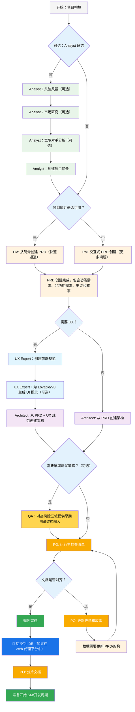

# BMad Method — 用户指南

本指南将帮助您理解并有效使用 BMad Method 进行敏捷 AI 驱动的规划和开发。

## BMad 规划与执行工作流

首先，以下是完整的标准 Greenfield 规划+执行工作流。 Brownfield 工作流非常相似，但建议先了解 Greenfield 工作流，即使是在简单项目上，再着手处理 Brownfield 项目。BMad Method需要安装到新项目文件夹的根目录。在规划阶段，您可以选择使用强大的网络代理来执行，这样可能会产生更高质量的结果，且成本仅为在某些代理工具中提供自己的 API 密钥或积分的一小部分。对于规划工作，强大的思维模型和更大的上下文——以及与代理合作——将带来最佳效果。

如果您要在 Brownfield 项目（现有项目）中使用 BMad Method，请查看**[Working in the Brownfield](./working-in-the-brownfield_ZH.md)**。

如果下面的图表无法渲染，请在 VSCode 中安装 Markdown All in One 以及 Markdown Preview Mermaid Support 插件（或其分叉版本）。安装这些插件后，当您打开标签时右键点击，应该会有一个 Open Preview 选项，或者请查看 IDE 文档。

### 规划工作流（Web UI 或强大的 IDE 代理）

在开发开始之前，BMad 遵循一个结构化的规划工作流，理想情况下在 web UI 中进行以提高成本效益：



#### Web UI 到 IDE 的过渡

**关键过渡点**：一旦产品负责人确认文档对齐，您必须从 web UI 切换到 IDE 开始开发工作流：

1. **将文档复制到项目**：确保 `docs/prd.md` 和 `docs/architecture.md` 位于项目的 docs 文件夹中（或您可以在安装期间指定的自定义位置）
2. **切换到 IDE**：在您首选的智能 IDE 中打开项目
3. **文档分片**：使用产品负责人代理对 PRD 然后对架构进行分片
4. **开始开发**：开始下面的核心开发周期

#### 规划工件（标准路径）

```text
PRD              → docs/prd.md
架构文档          → docs/architecture.md
分片史诗          → docs/epics/
分片故事          → docs/stories/
QA 评估          → docs/qa/assessments/
QA 检查门         → docs/qa/gates/
```

### 核心开发周期（IDE）

一旦规划完成并对文档进行分片，BMad 将遵循结构化的开发工作流程：

```mermaid
graph TD
    A["开发阶段开始"] --> B["SM：审查上一个故事的开发/QA 笔记"]
    B --> B2["SM：从分片史诗 + 架构起草下一个故事"]
    B2 --> S{"高风险故事？（可选）"}
    S -->|是| T["QA：对草拟故事进行 *risk + *design"]
    S -->|否| B3
    T --> U["QA：测试策略和风险概况已创建"]
    U --> B3{"PO：验证故事草稿（可选）"}
    B3 -->|请求验证| B4["PO：对照工件验证故事"]
    B3 -->|跳过验证| C{"用户批准"}
    B4 --> C
    C -->|已批准| D["Dev：按顺序执行任务"]
    C -->|需要修改| B2
    D --> E["Dev：实现任务 + 测试"]
    E --> V{"开发中期 QA 检查？（可选）"}
    V -->|是| W["QA：进行 *trace 或 *nfr 早期验证"]
    V -->|否| F
    W --> X["Dev：解决覆盖率/NFR 差距"]
    X --> F["Dev：运行所有验证"]
    F --> G["Dev：标记为准备审查 + 添加注释"]
    G --> H{"用户验证"}
    H -->|请求 QA 审查| I["QA：测试架构师审查 + 质量检查门"]
    H -->|无需 QA 直接批准| M["重要：验证所有回归测试和代码检查都通过"]
    I --> J["QA：测试架构分析 + 主动重构"]
    J --> L{"QA 决定"}
    L -->|需要开发工作| D
    L -->|已批准| M
    H -->|需要修复| D
    M --> N["重要：继续之前请提交您的更改！"]
    N --> Y{"需要更新检查门？"}
    Y -->|是| Z["QA：使用 *gate 更新状态"]
    Y -->|否| K
    Z --> K["将故事标记为完成"]
    K --> B

    style A fill:#f5f5f5,color:#000
    style B fill:#e8f5e9,color:#000
    style B2 fill:#e8f5e9,color:#000
    style S fill:#e3f2fd,color:#000
    style T fill:#ffd54f,color:#000
    style U fill:#ffd54f,color:#000
    style B3 fill:#e3f2fd,color:#000
    style B4 fill:#fce4ec,color:#000
    style C fill:#e3f2fd,color:#000
    style D fill:#e3f2fd,color:#000
    style E fill:#e3f2fd,color:#000
    style V fill:#e3f2fd,color:#000
    style W fill:#ffd54f,color:#000
    style X fill:#e3f2fd,color:#000
    style F fill:#e3f2fd,color:#000
    style G fill:#e3f2fd,color:#000
    style H fill:#e3f2fd,color:#000
    style I fill:#f9ab00,color:#fff
    style J fill:#ffd54f,color:#000
    style K fill:#34a853,color:#fff
    style L fill:#e3f2fd,color:#000
    style M fill:#ff5722,color:#fff
    style N fill:#d32f2f,color:#fff
    style Y fill:#e3f2fd,color:#000
    style Z fill:#ffd54f,color:#000
```



## 先决条件

在安装 BMad Method之前，请确保您已具备：

- **Node.js** ≥ 18，**npm** ≥ 9
- **Git** 已安装并配置
- **（可选）**安装了 "Markdown All in One" + "Markdown Preview Mermaid Support" 扩展的 VS Code

## 安装

### 可选

如果您想在网络上使用 Claude (Sonnet 4 或 Opus)、Gemini Gem (2.5 Pro) 或 Custom GPTs 进行规划：

1. 导航至 `dist/teams/`
2. 复制 `team-fullstack.txt`
3. 创建新的 Gemini Gem 或 CustomGPT
4. 上传文件并附带说明："Your critical operating instructions are attached, do not break character as directed"
5. 输入 `/help` 查看可用命令

### IDE 项目设置

```bash
# 交互式安装（推荐）
npx bmad-method install
```

### OpenCode

BMAD 通过项目级别的 `opencode.jsonc`/`opencode.json` 与 OpenCode 集成（仅 JSON，无 Markdown 后备）。

- 安装：
  - 运行 `npx bmad-method install` 并在 IDE 列表中选择 `OpenCode`。
  - 安装程序将检测现有的 `opencode.jsonc`/`opencode.json`，如果不存在则创建最小的 `opencode.jsonc`。
  - 它将：
    - 确保 `instructions` 包含 `.bmad-core/core-config.yaml`（以及每个选定扩展包的 `config.yaml`）。
    - 使用文件引用（`{file:./.bmad-core/...}`）幂等地合并 BMAD 代理和命令。
    - 保留其他顶级字段和用户定义的条目。

- 前缀和冲突：
  - 您可以选择为代理键添加 `bmad-` 前缀，为命令键添加 `bmad:tasks:` 前缀，以避免名称冲突。
  - 如果键已存在且非 BMAD 管理，安装程序将跳过它并建议启用前缀。

- 添加的内容：
  - `instructions`：`.bmad-core/core-config.yaml` 以及任何选定扩展包的 `config.yaml` 文件。
  - `agent`：来自核心和选定包的 BMAD 代理。
    - `prompt`：`{file:./.bmad-core/agents/<id>.md}`（或包路径）
    - `mode`：协调器为 `primary`，否则为 `all`
    - `tools`：`{ write: true, edit: true, bash: true }`
    - `description`：从代理的 `whenToUse` 中提取
  - `command`：来自核心和选定包的 BMAD 任务。
    - `template`：`{file:./.bmad-core/tasks/<id>.md}`（或包路径）
    - `description`：从任务的 “Purpose” 部分提取

- 仅包含选定包：
  - 安装程序仅包含您在早期步骤中选择的包（核心和所选包）中的代理和任务。

- 更改后刷新：
  - 重新运行：
    ```bash
    npx bmad-method install -f -i opencode
    ```
  - 安装程序安全地更新条目而不会重复，并保留您的自定义字段和注释。

- 可选的便捷脚本：
  - 您可以在项目的 `package.json` 中添加脚本以快速刷新：
    ```json
    {
      "scripts": {
        "bmad:opencode": "bmad-method install -f -i opencode"
      }
    }
    ```

### Codex (CLI 和 Web)

BMAD 通过 `AGENTS.md` 和已提交的核心代理文件与 OpenAI Codex 集成。

- 两种安装模式：
  - Codex（仅本地）：保持 `.bmad-core/` 被忽略，仅用于本地开发。
    - `npx bmad-method install -f -i codex -d .`
  - 启用 Codex Web：确保 `.bmad-core/` 被跟踪，以便您可以为 Codex Web 提交它。
    - `npx bmad-method install -f -i codex-web -d .`

- 生成的内容：
  - 项目根目录下的 `AGENTS.md`，其中包含 BMAD 部分
    - 如何在 Codex 中使用（CLI 和 Web）
    - 代理目录（标题、ID、何时使用）
    - 详细的每个代理部分，包含源路径、何时使用、激活短语和 YAML
    - 任务的快速使用说明
  - 如果存在 `package.json`，将添加有用的脚本：
    - `bmad:refresh`、`bmad:list`、`bmad:validate`

- 使用 Codex：
  - CLI：在项目根目录运行 `codex` 并自然地提示，例如 "As dev, implement …"。
  - Web：提交 `.bmad-core/` 和 `AGENTS.md`，然后在 Codex 中打开存储库并以相同方式提示。

- 更改后刷新：
  - 重新运行适当的安装模式（`codex` 或 `codex-web`）以更新 `AGENTS.md` 中的 BMAD 块。

## 特殊代理

BMad 有两个特殊代理——将来它们会合并为一个单一的 BMad-Master。

### BMad-Master

除了实际的故事实现外，这个代理可以执行所有其他代理可以执行的任何任务或命令。此外，这个代理还可以在网络上通过访问知识库来帮助您解释 BMad Method，并向您解释有关该过程的任何内容。

如果除了开发代理之外，您不想在不同代理之间切换，那么这就是适合您的代理。请记住，随着上下文的增长，代理的性能会下降，因此重要的是要指示代理压缩对话，并以压缩的对话作为初始消息开始新对话。经常这样做，最好在每个故事实现后进行。

### BMad-Orchestrator

这个代理不应在 IDE 中使用，它是一个重量级的专用代理，利用大量上下文并可以转变为任何其他代理。它的存在只是为了促进网络包中的团队协作。如果您使用网络包，您将受到 BMad Orchestrator 的欢迎。

### 代理工作原理

#### 依赖系统

每个代理都有一个定义其依赖关系的 YAML 部分：

```yaml
dependencies:
  templates:
    - prd-template.md
    - user-story-template.md
  tasks:
    - create-doc.md
    - shard-doc.md
  data:
    - bmad-kb.md
```

**关键点：**

- 代理仅加载它们需要的资源（精简上下文）
- 依赖关系在打包过程中自动解析
- 资源在代理之间共享以保持一致性

#### 代理交互

**在 IDE 中：**

```bash
# 一些 IDE，如 Cursor 或 Windsurf 等，使用手动规则，交互通过 '@' 符号完成
@pm 为任务管理应用创建一个 PRD
@architect 设计系统架构
@dev 实现用户认证

# 一些 IDE，如 Claude Code，则使用斜杠命令
/pm 创建用户故事
/dev 修复登录错误
```

#### 交互模式

- **增量模式**：在用户输入下逐步进行
- **YOLO 模式**：快速生成，最少交互

## IDE 集成

### IDE 最佳实践

- **上下文管理**：仅将相关文件保留在上下文中，保持文件尽可能精简和专注
- **代理选择**：为任务使用适当的代理
- **迭代开发**：以小而专注的任务进行工作
- **文件组织**：维护整洁的项目结构
- **定期提交**：经常保存您的工作

## 测试架构师（QA 代理）

### 概述

BMad 中的 QA 代理不仅仅是一个"高级开发人员审查员"——它是一个**测试架构师**，在测试策略、质量门控和基于风险的测试方面拥有深深的专业知识。这个名为 Quinn 的代理在质量问题上提供咨询权威，同时在安全的情况下主动改进代码。

#### 快速入门（基本命令）

```bash
@qa *risk {story}       # 在开发前评估风险
@qa *design {story}     # 创建测试策略
@qa *trace {story}      # 在开发过程中验证测试覆盖率
@qa *nfr {story}        # 检查质量属性
@qa *review {story}     # 全面评估 → 写入门控文件
```

#### 命令别名（测试架构师）

文档为了方便使用简写形式。两种风格都有效：

```text
*risk    → *risk-profile
*design  → *test-design
*nfr     → *nfr-assess
*trace   → *trace-requirements（或简写为 *trace）
*review  → *review
*gate    → *gate
```

### 核心能力

#### 1. 风险分析 (`*risk`)

**时机：**在故事草稿完成后，开发开始前（最早的干预点）

识别并评估实施风险：

- **类别**：技术、安全、性能、数据、业务、运营
- **评分**：概率 × 影响分析（1-9 分制）
- **缓解措施**：针对每个识别的风险的具体策略
- **门控影响**：风险 ≥9 触发 FAIL，≥6 触发 CONCERNS（详见 `tasks/risk-profile.md` 中的权威规则）

#### 2. 测试设计 (`*design`)

**时机：**在故事草稿完成后，开发开始前（指导编写哪些测试）

创建全面的测试策略，包括：

- 每个验收标准的测试场景
- 适当的测试级别建议（单元测试 vs 集成测试 vs E2E 测试）
- 基于风险的优先级（P0/P1/P2）
- 测试数据要求和模拟策略
- CI/CD 集成的执行策略

**示例输出：**

```yaml
test_summary:
  total: 24
  by_level:
    unit: 15
    integration: 7
    e2e: 2
  by_priority:
    P0: 8 # 必须有 - 与关键风险相关
    P1: 10 # 应该有 - 中等风险
    P2: 6 # 最好有 - 低风险
```

#### 3. 需求跟踪 (`*trace`)

**时机：**在开发过程中（中期实施检查点）

将需求映射到测试覆盖率：

- 记录哪些测试验证每个验收标准
- 使用 Given-When-Then 格式确保清晰（仅用于文档，非 BDD 代码）
- 识别覆盖率差距并给出严重程度评级
- 创建可追溯矩阵用于审计目的

#### 4. NFR 评估 (`*nfr`)

**时机：**在开发过程中或早期审查时（验证质量属性）

验证非功能性需求：

- **四大核心**：安全性、性能、可靠性、可维护性
- **基于证据**：寻找实际实施的证据
- **门控集成**：NFR 失败直接影响质量门控

#### 5. 全面测试架构审查 (`*review`)

**时机：**开发完成后，故事标记为"准备审查"

当你运行 `@qa *review {story}` 时，Quinn 会执行：

- **需求可追溯性**：将每个验收标准映射到其验证测试
- **测试级别分析**：确保在单元、集成和 E2E 级别进行适当的测试
- **覆盖率评估**：识别差距和冗余的测试覆盖
- **主动重构**：在安全的情况下直接改进代码质量
- **质量门控决策**：基于发现发布 PASS/CONCERNS/FAIL 状态

#### 6. 质量门控 (`*gate`)

**时机：**审查修复后或门控状态需要更新时

管理质量门控决策：

- **确定性规则**：PASS/CONCERNS/FAIL 的明确标准
- **并行权限**：QA 拥有 `docs/qa/gates/` 中的门控文件
- **咨询性质**：提供建议，而非阻止
- **豁免支持**：在需要时记录已接受的风险

**注意：**门控是咨询性质的；团队选择自己的质量标准。WAIVED 需要理由、批准者和过期日期。有关架构和规则，请参阅 `templates/qa-gate-tmpl.yaml`、`tasks/review-story.md`（门控规则）和 `tasks/risk-profile.md`（评分标准）。

### 与测试架构师协作

#### 与BMad工作流集成

测试架构师在整个开发生命周期中提供价值。以下是何时以及如何利用每种功能：

| **阶段**          | **命令**    | **使用时机**             | **价值**                  | **输出**                                                     |
| ------------------ | ----------- | ------------------------ | ------------------------- | -------------------------------------------------------------- |
| **故事起草**       | `*risk`     | 产品负责人起草故事后     | 及早识别潜在问题          | `docs/qa/assessments/{epic}.{story}-risk-{YYYYMMDD}.md`        |
|                    | `*design`   | 风险评估后               | 指导开发人员制定测试策略  | `docs/qa/assessments/{epic}.{story}-test-design-{YYYYMMDD}.md` |
| **开发阶段**       | `*trace`    | 实施过程中               | 验证测试覆盖范围          | `docs/qa/assessments/{epic}.{story}-trace-{YYYYMMDD}.md`       |
|                    | `*nfr`      | 构建功能时               | 及早发现质量问题          | `docs/qa/assessments/{epic}.{story}-nfr-{YYYYMMDD}.md`         |
| **评审阶段**       | `*review`   | 故事标记为完成时         | 全面质量评估              | 故事中的QA结果 + 门控文件                                     |
| **评审后**         | `*gate`     | 修复问题后               | 更新质量决策              | 更新的 `docs/qa/gates/{epic}.{story}-{slug}.yml`              |

#### 示例命令

```bash
# 规划阶段 - 在开发开始前运行这些命令
@qa *risk {draft-story}     # 可能出现什么问题？
@qa *design {draft-story}   # 我们应该编写哪些测试？

# 开发阶段 - 在编码过程中运行这些命令
@qa *trace {story}          # 我们是否测试了所有内容？
@qa *nfr {story}            # 我们是否满足质量标准？

# 评审阶段 - 在开发完成时运行
@qa *review {story}         # 全面评估 + 重构建议

# 评审后 - 在解决问题后运行
@qa *gate {story}           # 更新门控状态
```

### 强制执行的质量标准

Quinn 执行以下测试质量原则：

- **无不稳定测试**：通过适当的异步处理确保可靠性
- **无硬等待**：仅使用动态等待策略
- **无状态和并行安全**：测试独立运行
- **自清洁**：测试管理自己的测试数据
- **适当的测试级别**：单元测试用于逻辑，集成测试用于交互，E2E 测试用于用户旅程
- **明确的断言**：断言保留在测试中，不在辅助函数中

### 门控状态含义

- **PASS**：满足所有关键要求，无阻塞问题
- **CONCERNS**：发现非关键问题，团队应审查
- **FAIL**：应解决的关键问题（安全风险、缺失的 P0 测试）
- **WAIVED**：问题已确认但团队明确接受

### 特殊情况

**高风险故事：**

- 始终在开发开始前运行 `*risk` 和 `*design`
- 考虑在开发中期进行 `*trace` 和 `*nfr` 检查点

**复杂集成：**

- 在开发过程中运行 `*trace` 确保所有集成点都经过测试
- 后续使用 `*nfr` 验证集成间的性能

**性能关键型：**

- 在开发过程中早期且频繁地运行 `*nfr`
- 不要等到审查时才发现性能问题

**遗留代码：**

- 从 `*risk` 开始识别回归风险
- 使用 `*review` 特别关注向后兼容性

### 最佳实践

- **早期参与**：在故事起草期间运行 `*design` 和 `*risk`
- **基于风险的关注点**：让风险评分驱动测试优先级
- **迭代改进**：使用 QA 反馈改进未来的故事
- **门控透明度**：与团队分享门控决策
- **持续学习**：QA 记录模式以供团队知识共享
- **遗留代码谨慎**：特别关注现有系统中的回归风险

### 输出路径参考

测试架构师输出文件存储位置的快速参考：

```text
*risk-profile  → docs/qa/assessments/{epic}.{story}-risk-{YYYYMMDD}.md
*test-design   → docs/qa/assessments/{epic}.{story}-test-design-{YYYYMMDD}.md
*trace         → docs/qa/assessments/{epic}.{story}-trace-{YYYYMMDD}.md
*nfr-assess    → docs/qa/assessments/{epic}.{story}-nfr-{YYYYMMDD}.md
*review        → QA Results section in story + gate file reference
*gate          → docs/qa/gates/{epic}.{story}-{slug}.yml
```

## 技术偏好系统

BMad 通过位于 `.bmad-core/data/` 中的 `technical-preferences.md` 文件包含个性化系统 - 这可以帮助引导 PM 和架构师推荐您对设计模式、技术选择或您想要放在此处的任何其他内容的偏好。

### 在 Web 包中使用

在创建自定义 Web 包或上传到 AI 平台时，请包含您的 `technical-preferences.md` 内容，以确保代理从任何对话开始就了解您的偏好。

## 核心配置

`.bmad-core/core-config.yaml` 文件是一个关键配置，它使 BMad 能够无缝地与不同的项目结构配合工作，未来将会提供更多选项。目前最重要的是 yaml 中的 devLoadAlwaysFiles 列表部分。

### 开发人员上下文文件

定义开发代理应该始终加载哪些文件：

```yaml
devLoadAlwaysFiles:
  - docs/architecture/coding-standards.md
  - docs/architecture/tech-stack.md
  - docs/architecture/project-structure.md
```

你需要通过分割架构文档来验证这些文档是否存在，确保它们尽可能精简，并包含你希望开发代理始终加载到其上下文中的精确信息。这些是代理将遵循的规则。

随着项目的增长和代码开始形成一致的模式，编码标准应减少到只包含代理仍然需要执行的标准。代理会查看文件中的周围代码来推断与当前任务相关的编码标准。

## 获取帮助

- **Discord社区**：[加入Discord](https://discord.gg/gk8jAdXWmj)
- **GitHub Issues**：[报告错误](https://github.com/bmadcode/bmad-method/issues)
- **文档**：[浏览文档](https://github.com/bmadcode/bmad-method/docs)
- **YouTube**：[BMadCode频道](https://www.youtube.com/@BMadCode)

## 结论

请记住：BMad 旨在增强你的开发过程，而不是取代你的专业知识。将其用作强大的工具来加速项目，同时保持对设计决策和实现细节的控制。
