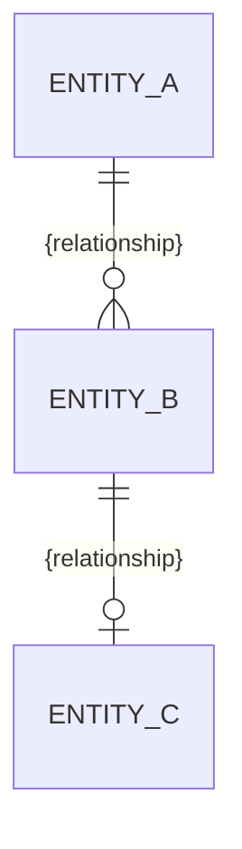

# Architecture Spine — {name}

> A consistency contract, not a design document. It fixes the **invariants** that keep the
> independently-built level below ({features | epics | stories}) coherent — the durable rules a
> clean codebase can't reveal. Structure is **seed**: the code owns the detail, the spine keeps the shape.
> Decisions, not rationale (that lives in the memlog). Diagrams over prose.
>
> **Scale to the job — drop any section a project doesn't need.** A small intent may be just a
> paradigm + a few `AD`s + conventions, seed omitted; a platform earns the full set. An inherited
> epic spine is usually mostly Inherited Invariants + a thin Deferred. Empty sections are cut, not left as headers.

## Design Paradigm

Name the pattern — a known one loads a whole model for free — and map its layers to namespaces /
directories. The smallest, most durable thing in the file.

## Inherited Invariants

Present only when this spine inherits a parent at a higher altitude (e.g. an epic spine under a
feature/initiative spine). The parent's `AD`s, conventions, and paradigm that bind here, listed by
their original parent IDs — **read-only, never renumbered, not re-derived**. This spine adds only
what the parent left open; anything here that a local decision would contradict is a conflict to
surface, not override.

| Inherited | From parent | Binds here |
| --- | --- | --- |
| {AD-n / convention} | {parent spine} | {what it constrains in this scope} |

## Invariants & Rules

The durable heart: the calls a future builder can't read from compliant code. Each `AD-n` has a
stable ID (never reused), a binding scope, the divergence it prevents, and an enforceable rule.
Cover the boundary/dependency rules (who may depend on whom) and how state is mutated — a
dependency-direction diagram says these better than prose. An `AD-n` the user asserted as
already-settled (or one verified from existing reality) carries an `[ADOPTED]` tag after its
title, so its provenance is legible versus decisions made here.

```mermaid
flowchart LR
  %% arrows = allowed dependency direction (a rule, not just structure)
```

### AD-1 — {decision}

- **Binds:** {capability / unit IDs, areas, or `all`}
- **Prevents:** {the divergence this stops}
- **Rule:** {the constraint downstream must follow}

## Consistency Conventions

The defaults that bind everything where independent builders would otherwise drift. Cut rows that
don't apply.

| Concern | Convention |
| --- | --- |
| Naming (entities, files, interfaces, events) | |
| Data & formats (IDs, dates, error shapes, envelopes) | |
| State & cross-cutting (mutation, errors, logging, config, auth) | |

## Structural Seed

Cold-start scaffolding, kept minimal — include an item only where its shape is non-obvious at this
altitude (at epic altitude the parent usually already fixed it, so the seed is often empty). The code
owns the **detail** (every file, every column); once code exists it becomes the source of truth for
detail, and this seed is a starting scaffold, not a mirror to maintain against it. Evolve a seed item
only when the **shape** itself changes — a new container, a new core entity, a stack bump — and let
the memlog keep the history.

- **Stack & Versions** — the substrate (mirrors frontmatter `stack`).
- **System Shape** — a container/context view (at epic altitude, the slice of the parent system this scope touches). Use `flowchart` with a `subgraph` per boundary; C4 mermaid is experimental and won't render in most viewers.
- **Core Entities** — an ERD of entities and their relationships. Names and relationships only; attributes belong to the code unless one is itself an invariant (then it's an `AD`, not seed).
- **Project Structure** — a minimal source tree, only as deep as consistency needs.

```mermaid
flowchart TD
  user(["{actor}"])
  subgraph sys["{system boundary}"]
    a["{container}<br/>{tech} — {role}"]
  end
  db[("{datastore}")]
  ext["{external system}"]
  user --> a
  a --> db
  a -->|{via port}| ext
```



```text
{root}/
  {dir}/   # {what lives here}
```

## Capability → Architecture Map

Bridges the spec's capabilities to the architecture (and is the consistency auditor's checklist).
Present when a spec drove this run.

| Capability / Area | Lives in | Governed by |
| --- | --- | --- |
| {CAP-n / area} | {component / module} | {AD-n, convention, paradigm} |

## Deferred

Decisions intentionally pushed down, each with the reason it can wait. The half of the contract
that keeps the spine lean.
